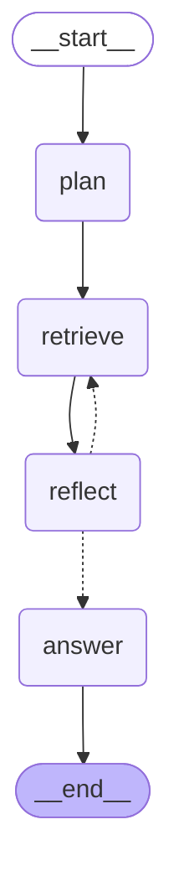

# `agent/` — Pulse agentic RAG service

FastAPI service on **:8001**. It owns retrieval and answer generation for chat; the Java API
(`api/`, :8080) keeps indexing and owns Postgres. See `PRD-agentic.md` §6 for the contracts.

## The graph

`POST /chat` runs a LangGraph `StateGraph` (`src/agent/graph/`), built explicitly rather than with
`create_react_agent` so the loop is a single named conditional edge. Output of
`build_graph().get_graph().draw_mermaid()`:



| Node | What it does |
|---|---|
| `plan` | Fetches `/internal/context/{profile,items,github}` concurrently, shows the model an **inventory** (list sizes, resume length, repo names — no content), and asks it to pick source types to search, sections to pull whole, and a standalone search query. |
| `retrieve` | Hybrid dense + BM25 search against Qdrant, fused server-side with RRF (`k=60`), floored at `0.008` client-side. Results from both rounds are merged on `(source_type, source_key, chunk_index)` at their best score. |
| `reflect` | Asks the model whether the material answers the question. The only conditional edge. |
| `answer` | Assembles the `=== SECTION ===` context and generates under the grounding constraints carried over verbatim from `ChatService`. |

This replaces `ChatService`'s four hard-coded thresholds (`RESUME_INLINE_THRESHOLD` and friends):
the model decides search-vs-inline from the inventory, and decides whether it has enough to answer.

**Cost safety** — at most 2 retrieval rounds and at most 3 LLM calls per request. Those bind
together: once the iteration cap is reached, `reflect` short-circuits without a model call, because
it could only route to `answer` anyway. So the worst case is `plan` + one `reflect` + `answer`.

Every node appends a `TrajectoryStep`, which maps 1:1 onto `ChatService.RoutingDecision` — the
frontend renders the agent's reasoning with no changes.

## Endpoints

| Route | Auth | Notes |
|---|---|---|
| `GET /health` | none | Open on purpose — container and ALB health checks cannot set headers. |
| `POST /chat` | `X-Internal-Token` | 401 without a matching token. |

```
POST /chat
  body: { "userId": 1, "message": "...", "history": [{"role":"user","content":"..."}] }
  200:  { "message": "...",
          "sources":    [{"sourceType":"resume_section","sourceKey":"experience","score":0.031}],
          "trajectory": [{"sourceType":"plan","decision":"...","reason":"..."}] }
```

The wire format is camelCase because `trajectory[]` maps 1:1 onto `ChatService.RoutingDecision` in
Java, which the frontend already renders. Do not rename these fields.

## Environment

Copy `.env.example` to `.env` (gitignored) and fill it in — the values match
`api/.env.local.properties`.

| Var | Purpose |
|---|---|
| `INTERNAL_TOKEN` | Shared secret with the Java API, both directions. **Required** — no default, the service refuses to boot without it. |
| `QDRANT_URL`, `QDRANT_API_KEY` | Qdrant Cloud. The REST URL, unlike the Java client which needs the gRPC port. |
| `ANTHROPIC_API_KEY` | Generation — `claude-haiku-4-5` on every node, matching `AnthropicService.FAST_MODEL`. |
| `OPENAI_API_KEY` | **Embeddings only** — `text-embedding-3-small`, matching the Java `EmbeddingService`. Anthropic has no embeddings API, so the `openai` dependency here is deliberate and not a provider mixup. |
| `PULSE_API_URL` | Java internal context API (issue 06). Defaults to `http://localhost:8080`; compose overrides it to `http://api:8080`. |
| `LANGFUSE_PUBLIC_KEY`, `LANGFUSE_SECRET_KEY`, `LANGFUSE_HOST` | Tracing. Blank keys disable tracing instead of failing to boot. Must match the api's, or the two halves of a chat trace land in different projects. |

## Tracing

One Langfuse trace spans both services. The Java API starts `pulse.rag.chat` and its WebClient
observations put a W3C `traceparent` on the outbound call; `agent/observability.py` attaches that
context before the observed handler runs, so everything below joins the same trace:

```
pulse.rag.chat (Java)
└── http post (Java, the WebClient client observation — this is the span traceparent names)
    └── POST /chat
        └── LangGraph
            ├── plan     → Anthropic generation
            ├── retrieve → search_knowledge (retriever)
            ├── reflect  → Anthropic generation
            └── answer   → Anthropic generation
```

Per-node and per-generation spans come from `langfuse.langchain.CallbackHandler`, passed to
`graph.ainvoke`. `search_knowledge` adds `retrieval.top_k`, `retrieval.hit_count`,
`retrieval.top_rrf_score` and `retrieval.sources` (source keys and scores); `run_chat` adds
`agent.iterations` and `agent.sources_queried`.

In the real trace `search_knowledge` is a *sibling* of `LangGraph` rather than a child of the
`retrieve` node that called it: LangGraph runs each node in its own asyncio task, which copies the
OTel context before `CallbackHandler` attaches the node span, so `@observe` still sees `POST /chat`
as current. All the attributes are there; only the depth is off.

**No prompt or completion body is exported.** `mask_otel_spans` deletes the Langfuse input/output
attributes from every span at export time and marks it `pulse.redacted=true`. The agent's prompts
contain retrieved chunks and, when the planner inlines it, the whole resume, so the choice is the
same one the Java side made in issue 09: nothing free-text leaves the process, and the trace is
debugged through the structured attributes above instead.

The `langchain` dependency exists only because `langfuse.langchain` imports it to branch on its
major version — the code here uses `langchain-core` and `langchain-anthropic`.

## Local run

```bash
cd agent
uv sync
uv run uvicorn agent.main:app --reload --port 8001

curl localhost:8001/health
curl -X POST localhost:8001/chat -H "X-Internal-Token: dev" -H "Content-Type: application/json" \
  -d '{"userId":1,"message":"hello"}'
```

On startup the service reads the `knowledge_chunks` collection from Qdrant and logs its status and
point count. A failure there is logged, not fatal — `/health` still answers so the container reports
the reason instead of crash-looping.

## Tests

```bash
uv run pytest
uv run ruff check
```

Tests never reach Qdrant, Anthropic, or the Java API. `test_main.py` stubs `run_chat` and covers the
HTTP contract; `test_graph.py` replaces the model, the search, and the three context fetches, so it
asserts control flow and prompt assembly rather than model behaviour. `TestClient` is also not used
as a context manager, so the lifespan hook that reads the collection does not run.

## Docker

From the repo root, `docker-compose.yml` brings up `api` (:8080) and `agent` (:8001). Both read
gitignored env files — `api/.env.local.properties` and `agent/.env` — which must exist first.

```bash
docker compose up --build
```

Qdrant is Qdrant Cloud, not a compose service.
